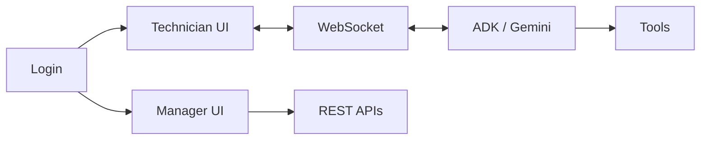

# FieldVision

**AI-Powered Industrial Safety Assistant**

FieldVision is a real-time AI copilot for industrial maintenance technicians. Built on the **Google Agent Development Kit (ADK)** with Gemini's bidi-streaming Live API, it provides hands-free voice interaction, continuous visual safety monitoring, and automated compliance logging.


## Features

- **Real-time video analysis** — Continuous monitoring for safety hazards, PPE compliance, and procedure verification
- **Hands-free voice interface** — Full two-way audio conversation using Gemini Live API with bidi-streaming
- **Multi-turn text and audio Q&A** — Ask multiple questions via text or voice within the same session; conversation history is maintained across turns
- **Automated reporting** — HTML session reports with AI executive summaries and audit logs; PDF work-order reports for a date range
- **Manager dashboard** — Live video feeds from all active technician sessions for supervisors
- **Work order management** — End-to-end workflow: create (via voice), approve, and complete maintenance work orders
- **Session resumption** — "New Topic" feature allows seamless context switching without reloading
- **Technical manual integration** — Cached `manuals/safety_manual.md` is loaded at agent startup via [app/manual_loader.py](app/manual_loader.py) and injected into the agent's system instruction for grounded Q&A
- **Badge verification** — After a voice work-order request, the agent asks the user to show their ID badge; `verify_badge` reads name/ID/department from the video and checks [users.json](users.json) to create or escalate the work order ([app/fieldvision_agent/tools.py](app/fieldvision_agent/tools.py))
- **Evidence capture** — For safety events with severity >= 4, a JPEG frame is saved under `static/evidence/` and linked in the audit ([app/fieldvision_agent/tools.py](app/fieldvision_agent/tools.py))
- **Work order reports** — Managers/supervisors can download a PDF work-orders report for a date range via `GET /api/reports/work-orders?start=...&end=...` ([main.py](main.py), [app/report_generator.py](app/report_generator.py))
- **Site-wide summary** — `GET /api/reports/site-wide-summary?hours=24` returns session counts, hazard counts, and active zones for dashboards ([main.py](main.py))
- **Role-based login** — JWT-based auth with technician/manager/supervisor roles and permissions in [users.json](users.json)
- **AI tool calling** — Automated safety event logging, work order creation, and badge verification via function calling

## Design Decisions

### Single Conversation per Session
FieldVision enforces a "one conversation per session" model. Each new safety session or topic change initiates a fresh conversation context.
- **Why?** This ensures a clean state for every interaction, preventing context pollution from previous tasks.
- **Benefit:** guarantees predictable AI behavior and accurate reporting for each distinct safety value, which is critical for compliance and demo purposes.


## Architecture

```
┌─────────────────┐     WebSocket      ┌─────────────────┐    ADK Runner     ┌─────────────────┐
│                 │ ◄─────────────────► │                 │ ◄───────────────► │                 │
│     Browser     │  Audio/Video/Text   │  FastAPI Server │  LiveRequestQueue │  Gemini Live    │
│   (Camera/Mic)  │                     │   + ADK Agent   │  Bidi-Streaming   │      API        │
│                 │ ◄─────────────────► │                 │ ◄───────────────► │                 │
└─────────────────┘   AI Responses      └─────────────────┘  Audio + Tools    └─────────────────┘
                                                │
                                                ▼
                                        ┌─────────────────┐
                                        │  audit_log.json │
                                        │  (Compliance)   │
                                        └─────────────────┘
```

## How the app works

**Authentication** — Users log in at `/login`. `POST /api/login` returns a JWT. The token is used for REST (`Authorization: Bearer <token>`) and for the WebSocket connection (`/ws?token=<token>`). Roles and permissions are defined in [users.json](users.json).

**Technician flow** — Open `/` (main app). Start a session; manual context from `safety_manual.md` is preloaded. The browser sends PCM audio (16 kHz) and JPEG video frames over WebSocket. The server uses [Google ADK](app/gemini_service.py) with Gemini Live (bidi-streaming). The agent can call tools: `log_safety_event` (writes to per-session audit logs and conversation log), `create_work_order` (stores a pending order in session state), and `verify_badge` (creates or escalates the work order in [app/work_orders.py](app/work_orders.py)). "New topic" starts a new conversation context without reloading.

**Manager / supervisor flow** — Open `/manager`. The dashboard lists active technician camera feeds; the latest frame per technician is served via `GET /api/camera-feeds/{user_id}/frame`. Work orders (pending, approved, completed) are listed; supervisors can approve or complete orders. PDF work-orders report and site-wide summary are available for reporting.

**Reporting** — Session-level: `GET /api/reports/{session_id}` returns an HTML report with event timeline and AI-generated executive summary ([app/reporting.py](app/reporting.py)). Work-order compliance: `GET /api/reports/work-orders?start=&end=` returns a PDF ([app/report_generator.py](app/report_generator.py)).



## Quick Start

### Prerequisites

- Python 3.11+
- Google Cloud account with Gemini API access
- Webcam and microphone

### Installation

```bash
# Clone the repository
git clone https://github.com/your-org/field-vision.git
cd field-vision

# Create virtual environment
python -m venv venv

# Activate (Windows)
.\venv\Scripts\activate

# Activate (Unix/macOS)
source venv/bin/activate

# Install dependencies
pip install -r requirements.txt
```

### Configuration

1. **Get your Gemini API Key** from [Google AI Studio](https://aistudio.google.com/apikey)

2. **Create a `.env` file** in the project root. You can copy from the template:
```bash
cp .env.example .env
```
Then set your API key in `.env`:
```env
GEMINI_API_KEY=your_gemini_api_key_here
```
Optional: set `HOST`, `PORT`, `SESSION_TTL_SECONDS`, `FRAME_RATE`, `JPEG_QUALITY`, `LOG_LEVEL`, `AUDIT_LOG_PATH`, `GEMINI_MODEL`, `INPUT_SAMPLE_RATE`, `OUTPUT_SAMPLE_RATE`, `MAX_RESUME_ATTEMPTS`, or `DEBUG` as needed (see Configuration options below).

### Running the Application

```bash
# Start the server
python -m uvicorn main:app --host 0.0.0.0 --port 8000 --reload
```

Open your browser to: **http://localhost:8000**

## Demo Credentials

Use these credentials to test different roles:

| Role | Username | Password | Permissions |
|------|----------|----------|-------------|
| **Technician** | `tech_042` | `field123` | Basic access, voice Q&A |
| **Sr. Technician** | `tech_078` | `field456` | + Create work orders |
| **Supervisor** | `sup_007` | `super789` | + Approve work orders, view zone feeds |
| **Manager** | `mgr_001` | `manage101` | Full system access, all feeds, reports |

## Project Structure

```
field-vision/
├── app/
│   ├── __init__.py
│   ├── config.py               # Pydantic settings
│   ├── audit.py                # Safety event logging
│   ├── auth.py                 # JWT auth, roles, permissions
│   ├── websocket_handler.py    # WebSocket ↔ ADK bidi-streaming bridge
│   ├── gemini_service.py       # ADK Runner, session mgmt, RunConfig
│   ├── fieldvision_agent/      # ADK Agent definition + tools
│   │   ├── agent.py
│   │   └── tools.py
│   ├── manual_loader.py        # Load/cache safety manual for grounding
│   ├── conversation_logger.py # Session transcripts
│   ├── work_orders.py         # Create, approve, complete work orders
│   ├── reporting.py           # HTML session reports
│   └── report_generator.py    # PDF work-orders report
├── static/
│   ├── index.html              # Main technician UI
│   ├── login.html              # Login page
│   ├── manager.html            # Manager dashboard
│   ├── app.js                  # Frontend application
│   ├── pcm-processor.js        # AudioWorklet for mic PCM streaming
│   ├── badges/                 # Badge images (e.g. for demo)
│   └── evidence/              # Created at runtime for captured frames
├── manuals/
│   └── safety_manual.md        # Technical manual for grounded Q&A
├── logs/                       # Audit and transcript logs
├── main.py                     # FastAPI application
├── requirements.txt
├── users.json                  # User credentials and permissions
├── pending_orders.json         # Work orders awaiting approval
├── approved_orders.json
├── completed_orders.json
├── .env.example              # Environment template (copy to .env)
├── ROADMAP.md
├── tests/
└── README.md
```

## API Reference

### WebSocket

Connect with `?token=<jwt>` (e.g. `ws://localhost:8000/ws?token=...`). The JWT is obtained from `POST /api/login`.

#### Client → Server

| Type | Payload | Description |
|------|---------|-------------|
| `start_session` | `{ manual_context?: string }` | Start a new AI session |
| `end_session` | `{}` | End current session |
| `audio_data` | `{ data: base64 }` | PCM16 audio at 16kHz |
| `video_frame` | `{ data: base64 }` | JPEG image frame |
| `text_message` | `{ text: string }` | Text input |

#### Server → Client

| Type | Payload | Description |
|------|---------|-------------|
| `session_started` | `{ session_id: string }` | Session confirmation |
| `audio_response` | `{ data: base64 }` | PCM16 audio at 24kHz |
| `text_response` | `{ text: string }` | Text response |
| `tool_call` | `{ function: string, arguments: object }` | Safety event logged |
| `error` | `{ error: string }` | Error message |

### REST Endpoints

| Method | Path | Description |
|--------|------|-------------|
| `GET` | `/` | Main application UI |
| `GET` | `/login` | Login page |
| `GET` | `/manager` | Manager dashboard |
| `GET` | `/health` | Health check |
| `POST` | `/api/login` | Login (body: `user_id`, `password`); returns JWT and user info |
| `GET` | `/api/me` | Current user info (auth required) |
| `GET` | `/api/session/{id}/summary` | Session audit summary |
| `GET` | `/api/session/{id}/events` | Session event list |
| `GET` | `/api/audit/logs` | List all historical sessions |
| `GET` | `/api/reports/{session_id}` | Generate HTML session report |
| `GET` | `/api/reports/work-orders` | PDF work-orders report (query: `start`, `end` ISO dates; auth required) |
| `GET` | `/api/reports/site-wide-summary` | Site-wide activity summary (query: `hours`, default 24) |
| `GET` | `/api/camera-feeds` | List active technician camera feeds (auth required) |
| `GET` | `/api/camera-feeds/{user_id}/frame` | Get latest video frame for a technician (auth required) |
| `GET` | `/api/work-orders` | List work orders (filtered by role) |
| `POST` | `/api/work-orders/{order_id}/approve` | Approve a pending work order |
| `POST` | `/api/work-orders/{order_id}/complete` | Mark a work order as completed |

## Safety Event Types

| Event Type | Description | Severity Range |
|------------|-------------|----------------|
| `missing_ppe` | PPE not detected (gloves, glasses, etc.) | 3-5 |
| `hazard_detected` | General safety hazard identified | 2-5 |
| `unsafe_position` | Body in dangerous position | 4-5 |
| `procedure_violation` | Incorrect procedure step | 3-4 |
| `equipment_issue` | Equipment problem detected | 2-5 |
| `environment_hazard` | Spill, obstruction, etc. | 2-5 |
| `step_verified` | Procedure step confirmed correct | 1 |
| `safety_check_passed` | Safety inspection passed | 1 |

## Configuration Options

| Variable | Default | Description |
|----------|---------|-------------|
| `GEMINI_API_KEY` | *required* | Google Gemini API key |
| `GEMINI_MODEL` | *(see config)* | Optional override for Gemini model |
| `HOST` | `0.0.0.0` | Server bind address |
| `PORT` | `8000` | Server port |
| `DEBUG` | `false` | Debug mode |
| `SESSION_TTL_SECONDS` | `3600` | Session timeout |
| `MAX_RESUME_ATTEMPTS` | `3` | Max session resume attempts |
| `INPUT_SAMPLE_RATE` | `16000` | Input audio sample rate (Hz) |
| `OUTPUT_SAMPLE_RATE` | `24000` | Output audio sample rate (Hz) |
| `FRAME_RATE` | `1` | Video capture FPS |
| `JPEG_QUALITY` | `85` | Image compression quality |
| `LOG_LEVEL` | `INFO` | Logging verbosity |
| `AUDIT_LOG_PATH` | `./logs/audit_log.json` | Audit log file path |

## Safety Governance

FieldVision adheres to responsible AI principles:

1. **Transparency** - All observations are logged and auditable
2. **AI Disclosure** - Responses explicitly labeled as AI-generated
3. **Advisory Only** - No direct machine control; humans perform all actions
4. **Human-in-the-Loop** - Safety sign-offs require human approval
5. **Accountability** - Each session has a clearly defined owner

## Future Roadmap

- [x] Multi-turn text & audio Q&A with conversation history
- [x] PDF-ready HTML compliance report generation
- [x] Role-based authentication
- [ ] AR glasses integration for hands-free HUD
- [ ] Multi-step LOTO sequence verification
- [ ] IoT sensor integration
- [ ] Cloud Run deployment for fleet scaling
- [ ] Firestore for persistent audit storage

## Contributing

1. Fork the repository
2. Create your feature branch (`git checkout -b feature/amazing-feature`)
3. Commit your changes (`git commit -m 'Add amazing feature'`)
4. Push to the branch (`git push origin feature/amazing-feature`)
5. Open a Pull Request

## License

This project is licensed under the MIT License - see the [LICENSE](LICENSE) file for details.

---

**Disclaimer**: FieldVision is an advisory system only. It does NOT control industrial equipment and should NOT be used as a primary safety mechanism. Always follow your organization's safety protocols and procedures.
